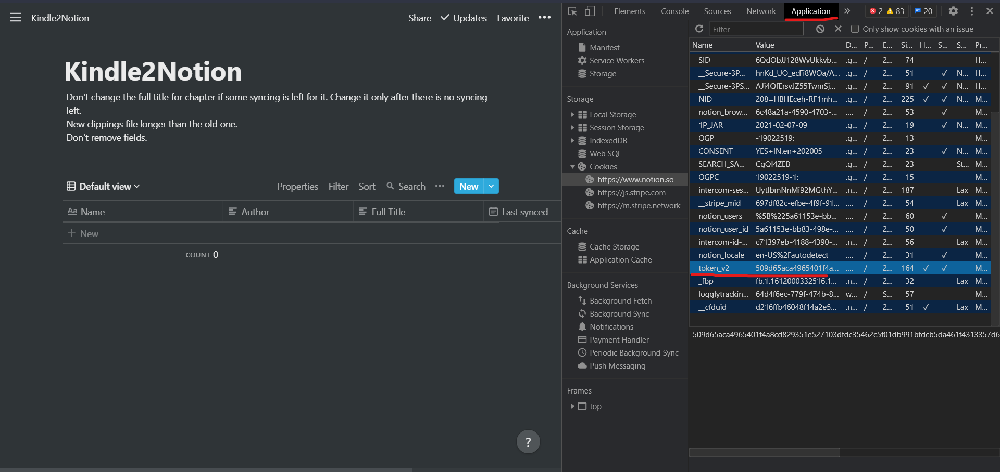
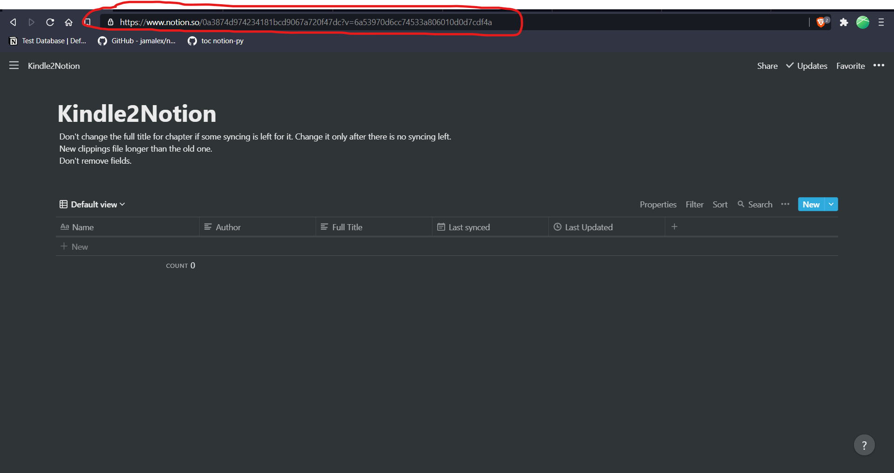

## Setup
You must have python3 installed on your system. After cloning the repository cd into it and run the following command to install the dependencies.
```
pip install -r requirements.txt
```
You must have a notion account and duplicate the template given below.
```
https://www.notion.so/0a3874d974234181bcd9067a720f47dc?v=6a53970d6cc74533a806010d0d7cdf4a
```
## Usage 
- Get the My Clippings.txt file from your kindle
- Since this code requires access of non-public pages, an authentication token from your Notion page is required. This token is stored in the token_v2 cookie. This can be found in the Storage tab of your browser's developer tools.
    - For Chrome: Open Developer Tools (Menu > Other tools > Developer Tools), navigate to Application tab and go to Storage\Cookies to find the token.
    

- Change env.example to .env and fill the values accordingly

## Description of environment variables
PATH_CLIPPINGS is the path to the kindle clippings on your system. You can use the sample clipings which has been provided.
TOKEN is the v2_token
DATABASE_URL is the url of the database

USE_LOCATION can be True or False.It is for deciding if location of the highlight on your kindle should be included.


TYPE_BLOCK is for the type of block. 0 is for quote block and 1 is for text block.


## Running  the code
Once all the environment variables are set run the program by
```
python run.py
```

## Dont's
- Don't delete the fields already present in the template otherwise the program won't work correctly. You can add new ones but it won't be populated by the program.
- Donot delete the donotdelete folder that is created
- Don't change the Full Title field of the chapter in Notion if you are still reading it and would sync it multiple times. Change it only after there is no syncing left for that chapter.
- The new clippings that you are trying to sync should always be more in length than the older one.